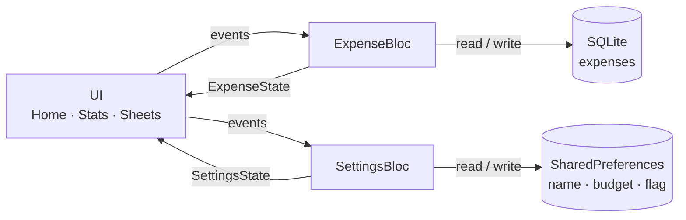

<div align="center">

# ▓▓ LEDGER ▓▓

### **NO BS. JUST NUMBERS.**

A neo-brutalist expense tracker that runs entirely on your phone.
No account. No sync. No telemetry. Just where the money went.

[](https://flutter.dev)
[](https://dart.dev)
[](https://bloclibrary.dev)
[](https://pub.dev/packages/sqflite)
[](#privacy)


</div>

---

## Why this exists

Most expense apps want an email address before they'll let you write down a $4 coffee. This one
doesn't. Everything lives in a local SQLite file, the UI is loud on purpose, and a PIN sits in front
of anything destructive.

| | |
| --- | --- |
| **Thick black borders, hard shadows, zero rounded corners** | Neo-brutalism, applied consistently through one theme file |
| **Add, edit, delete, categorize** | Eight categories, dated entries, optional notes |
| **Today / Week / Month / All** | Filter the total without refetching — the bloc holds the full list and derives each view |
| **Category breakdown** | Bar chart plus percentage rows for the current calendar month |
| **Monthly budget** | Set during onboarding, editable from the options sheet |
| **PIN lock** | Gates edit, delete, rename, budget changes, and clear-all |
| **Swipe to delete** | With a confirm dialog *and* the PIN check before the row leaves |
| **Four-step onboarding** | Welcome → name → budget → categories, restartable any time |

<details>
<summary><b>More screenshots</b> — drawer, options sheet, onboarding</summary>

<br />

<div align="center">


</div>

</details>

---

## Quick start

```bash
git clone https://github.com/siraajul/ledger.git
cd ledger
flutter pub get
flutter run          # -d <device_id> to pick a target; flutter devices to list them
```

Requires the Flutter SDK (Dart `^3.13.3`). Package name `ledger`, application id
`com.example.ledger`.

---

## Architecture

State is **BLoC** end to end — events in, immutable state out. Two blocs are provided above
`MaterialApp`, so every route, dialog, and modal sheet can reach them without prop-drilling.



### ExpenseBloc

| Event | What happens |
| --- | --- |
| `LoadExpenses` | Reads every row from SQLite |
| `FilterChanged(TimeFilter)` | Swaps the active filter — no database hit |
| `ExpenseAdded` / `ExpenseUpdated` / `ExpenseDeleted` | Writes through, then re-reads |
| `AllExpensesCleared` | Truncates the table, then re-reads |

`ExpenseState` keeps the **complete** list plus the active filter. Everything the screens render is
a derived getter:

```dart
state.filtered                // respects the user's Today/Week/Month/All choice  → Home
state.total                   // sum of the above                                 → Home
state.thisMonth               // always the calendar month, ignores the filter    → Stats
state.monthlyCategoryTotals   // category → amount, this month                    → Stats
```

One source of truth, two different views of it. A write re-emits state and **both** tabs update —
no manual refresh, no `GlobalKey` reaching into another screen's state.

### SettingsBloc

Owns the three `SharedPreferences` keys — `user_name`, `monthly_budget`, `onboarding_complete` —
behind `UserNameChanged`, `BudgetChanged`, `OnboardingCompleted`, and `OnboardingReset`. No widget
reads those keys directly, so editing the budget in the options sheet updates the drawer and the
home header the same frame.

`AuthCheck` simply watches `onboardingComplete` and swaps between `OnboardingScreen` and
`MainShell`. Finishing or restarting onboarding is a state change, not a navigation-stack rewrite.

### Persistence

| Data | Where | Accessed by |
| --- | --- | --- |
| Expenses | SQLite via `sqflite` (`lib/database/database_helper.dart`) | `ExpenseBloc` only |
| Name, budget, onboarding flag | `SharedPreferences` | `SettingsBloc` only |
| PIN | `SharedPreferences` | `PinDialog` |

---

## Project layout

```
lib/
├── main.dart                 # entry point only — runApp + system chrome
├── app.dart                  # MultiBlocProvider → MaterialApp → AuthCheck
├── theme.dart                # the entire neo-brutalist palette, shadows, ThemeData
├── bloc/
│   ├── expense/              # expense_event · expense_state · expense_bloc
│   └── settings/             # settings_event · settings_state · settings_bloc
├── models/expense.dart       # Expense + the eight categories
├── database/
│   └── database_helper.dart  # schema and queries
├── screens/
│   ├── main_shell.dart       # drawer · tabs · FAB · bottom nav
│   ├── home_screen.dart      # list, totals, time filters
│   ├── stats_screen.dart     # category breakdown
│   ├── add_expense_screen.dart
│   └── onboarding/           # welcome · name · budget · categories · tutorial
└── widgets/                  # drawer, options sheet, PIN dialog, cards, animations
```

Every screen and widget is a `BlocBuilder` consumer — none of them touch SQLite or
`SharedPreferences` directly.

---

## Testing

```bash
flutter test                    # unit + widget
flutter test integration_test   # needs a connected device
flutter analyze
```

`test/expense_state_test.dart` pins down the filtering and totals logic — the part that decides what
every screen displays, and the part most likely to break without anyone noticing.
`TEST_PLAN.md` holds the manual edge-case checklist covering onboarding, PIN, and the destructive
flows.

---

## Privacy

Nothing leaves the device. There is no backend, no analytics, no crash reporting, and the app
requests no network permission.

Two things worth knowing:

- **There is no backup.** Uninstalling, clearing app data, or tapping **CLEAR ALL DATA** is
  irreversible.
- **The PIN is a convenience lock**, stored in plain `SharedPreferences`. It keeps casual hands out
  of your expenses on an unlocked phone. It is not encryption, and it does not protect the SQLite
  file from anyone with real access to the device.

---

<div align="center">

**LEDGER v1.0** · Built with Flutter

</div>
