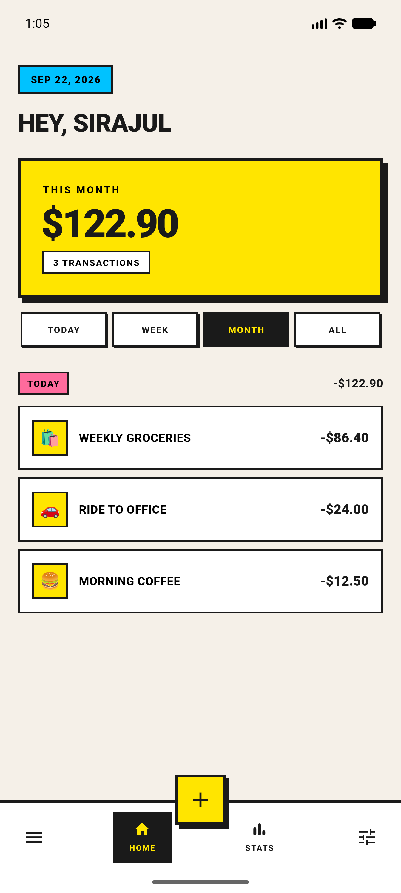
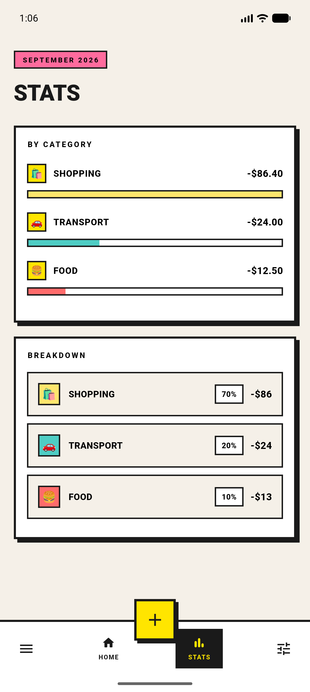
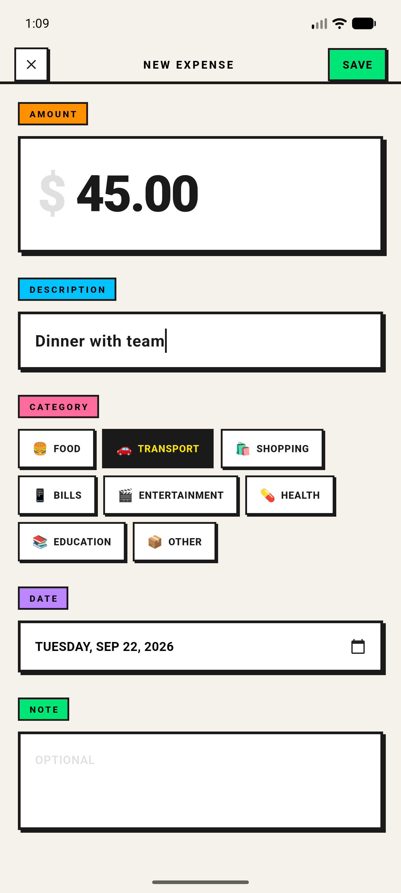
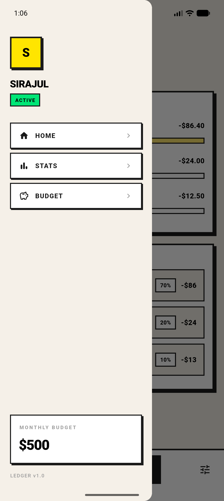
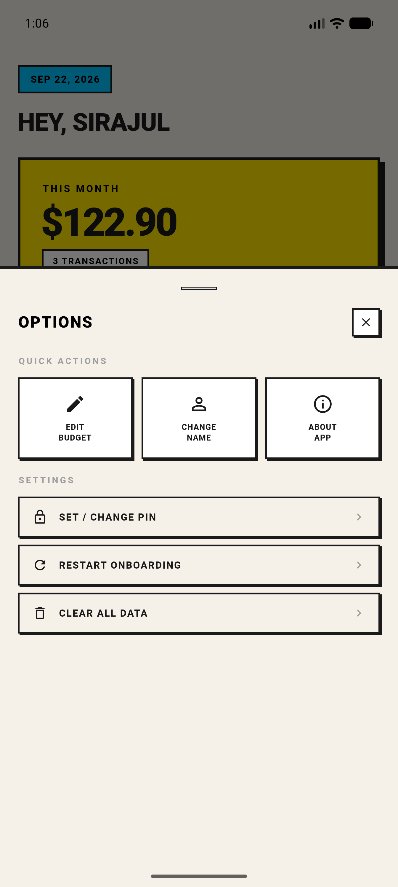
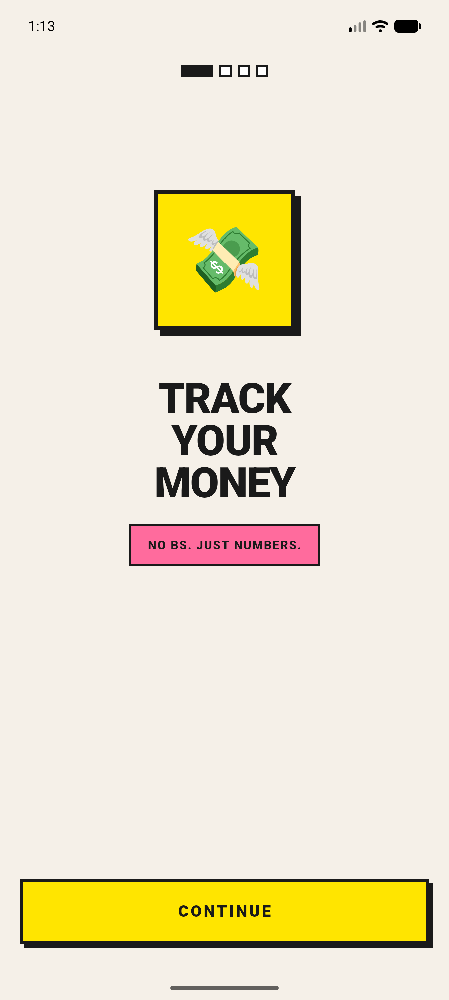
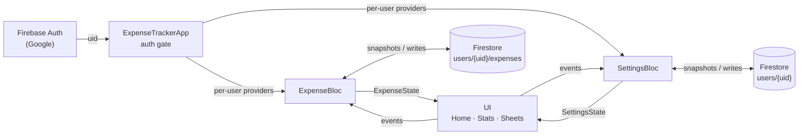

<div align="center">

# ▓▓ LEDGER ▓▓

### **NO BS. JUST NUMBERS.**

A neo-brutalist expense tracker. Sign in with Google once, and your expenses and settings
follow you to every device — online or off.

[](https://flutter.dev)
[](https://dart.dev)
[](https://bloclibrary.dev)
[](https://firebase.google.com)
[](#sync-and-offline)





</div>

---

## What it does

Write down where the money went, see it by day, week, or month, and keep the same numbers on your
phone and tablet. The UI is loud on purpose, and a PIN sits in front of anything destructive.

| | |
| --- | --- |
| **Google Sign-In** | One tap; your account is the only thing that can read your data |
| **Sync across devices** | Expenses, name, budget, and onboarding state live in Firestore and update live |
| **Offline-first** | Add and edit with no signal; changes upload when you're back online |
| **Add, edit, delete, categorize** | Eight categories, dated entries, optional notes |
| **Today / Week / Month / All** | Filter the total without refetching — the bloc holds the full list and derives each view |
| **Category breakdown** | Bar chart plus percentage rows for the current calendar month |
| **Monthly budget** | Set during onboarding, editable from the options sheet |
| **Check-in reminders** | Daily nudges at times you pick (default 10:00, 14:00, 19:00), skipped when you've just logged (per device) |
| **PIN lock** | Gates edit, delete, rename, budget changes, and clear-all (per device) |
| **Swipe to delete** | With a confirm dialog *and* the PIN check before the row leaves |
| **Thick black borders, hard shadows, zero rounded corners** | Neo-brutalism, applied consistently through one theme file |

<details>
<summary><b>More screenshots</b> — drawer, options sheet, onboarding</summary>

<br />

<div align="center">



</div>

</details>

---

## Quick start

```bash
git clone https://github.com/siraajul/ledger.git
cd ledger
flutter pub get
flutter run          # -d <device_id> to pick a target; flutter devices to list them
```

Requires the Flutter SDK (Dart `^3.13.3`). Targets **Android and iOS**; web and desktop are not
configured.

| | |
| --- | --- |
| Package / bundle ID | `com.sirajul.ledger` (Android and iOS) |
| Firebase project | `ledger-cea2a` |
| Dart package name | `ledger` |

The Firebase client config (`lib/firebase_options.dart`, `android/app/google-services.json`,
`ios/Runner/GoogleService-Info.plist`) is committed. These values identify the project; they are not
secrets. Access is enforced by the [Firestore rules](firestore.rules).

### Google Sign-In on a new machine

Android sign-in only works for builds signed with a key whose **SHA-1 is registered** on the
Firebase Android app. To add your debug key:

```bash
keytool -list -v -keystore ~/.android/debug.keystore -storepass android | grep SHA1
npx -y firebase-tools@latest apps:android:sha:create \
  1:770523884423:android:efdc7400f47cf49876c122 <SHA1> --project ledger-cea2a
```

Then re-download `google-services.json` (`apps:sdkconfig ANDROID …`). iOS needs no extra step —
the client ID and URL scheme are already in `ios/Runner/Info.plist`.

### Using your own Firebase project

```bash
dart pub global activate flutterfire_cli
flutterfire configure --project=<your-project> --platforms=android,ios
```

Then enable Google sign-in and deploy the rules:

```bash
npx -y firebase-tools@latest deploy --only auth,firestore:rules --project <your-project>
```

Finally set `GIDClientID` / `CFBundleURLTypes` in `ios/Runner/Info.plist` from the new
`GoogleService-Info.plist`, and the `serverClientId` in `lib/main.dart` to your project's web
OAuth client ID.

---

## Architecture

State is **BLoC** end to end — events in, immutable state out.



`ExpenseTrackerApp` listens to the auth state. Signed out, it shows `LoginScreen`. Signed in, it
wraps `MaterialApp` in a `MultiBlocProvider` **keyed by uid**:

- Providers sit *above* `MaterialApp`, so pushed routes, dialogs, and bottom sheets can read them.
- Switching accounts throws the old blocs away and opens fresh streams — no data bleeds between
  users.

`AuthCheck` then watches `onboardingComplete` and swaps between `OnboardingScreen` and `MainShell`.
Finishing or restarting onboarding is a state change, not a navigation-stack rewrite.

### ExpenseBloc

| Event | What happens |
| --- | --- |
| `LoadExpenses` | Subscribes to the user's expenses (live), and uploads any pre-sync local SQLite rows once |
| `FilterChanged(TimeFilter)` | Swaps the active filter — no database hit |
| `ExpenseAdded` / `ExpenseUpdated` / `ExpenseDeleted` | Writes to Firestore; the listener re-emits |
| `AllExpensesCleared` | Batch-deletes the user's expenses |

Writes are fire-and-forget on purpose: Firestore applies them to its local cache immediately, so the
UI updates at once and the write is replayed when the device is online. Failures surface on the read
stream.

`ExpenseState` keeps the **complete** list plus the active filter. Everything the screens render is
a derived getter:

```dart
state.filtered                // respects the user's Today/Week/Month/All choice  → Home
state.total                   // sum of the above                                 → Home
state.thisMonth               // always the calendar month, ignores the filter    → Stats
state.monthlyCategoryTotals   // category → amount, this month                    → Stats
```

### SettingsBloc

Owns the name, monthly budget, and onboarding flag on the `users/{uid}` document, behind
`UserNameChanged`, `BudgetChanged`, `OnboardingCompleted`, and `OnboardingReset`. No widget talks to
Firestore directly.

- **Coalesced writes.** Onboarding sends an event per keystroke; edits are batched into one write
  every 400 ms. Onboarding completion and reset are written immediately.
- **Local edits win.** Values not yet written overlay incoming snapshots, so a sync from another
  device can't roll back what you're typing.
- **No onboarding flash.** On a device with an empty cache, the bloc stays loading until the server
  answers, instead of briefly showing onboarding to a returning user.
- **Migration.** Settings saved by pre-sync builds in `SharedPreferences` are uploaded on first
  sign-in, then removed locally.

### Data

| Data | Where | Accessed by |
| --- | --- | --- |
| Expenses | Firestore `users/{uid}/expenses/{id}` | `ExpenseRepository` → `ExpenseBloc` |
| Name, budget, onboarding flag | Firestore `users/{uid}` | `SettingsRepository` → `SettingsBloc` |
| PIN | `SharedPreferences` (this device only) | `PinDialog` |
| Reminder on/off, check-in times | `SharedPreferences` (this device only) | `ReminderService` |
| Legacy expenses (pre-sync builds) | SQLite via `sqflite` | read once for migration |

[`firestore.rules`](firestore.rules) restricts every document to its owner and validates fields,
types, and sizes on create and update.

---

## Project layout

```
lib/
├── main.dart                   # Firebase + Google Sign-In init, runApp
├── app.dart                    # auth gate → per-user MultiBlocProvider → MaterialApp → AuthCheck
├── firebase_options.dart       # generated by FlutterFire
├── theme.dart                  # the entire neo-brutalist palette, shadows, ThemeData
├── bloc/
│   ├── expense/                # expense_event · expense_state · expense_bloc
│   └── settings/               # settings_event · settings_state · settings_bloc
├── models/expense.dart         # Expense + the eight categories
├── database/
│   ├── expense_repository.dart # Firestore expenses + legacy SQLite migration
│   ├── settings_repository.dart# Firestore users/{uid} + legacy prefs migration
│   └── database_helper.dart    # legacy SQLite, read-only for migration
├── services/
│   ├── auth.dart               # Google sign-in / sign-out
│   └── reminder_service.dart   # schedules the "nothing logged" local notification
├── screens/
│   ├── login_screen.dart
│   ├── main_shell.dart         # drawer · tabs · FAB · bottom nav
│   ├── home_screen.dart        # list, totals, time filters
│   ├── stats_screen.dart       # category breakdown
│   ├── add_expense_screen.dart
│   ├── onboarding_screen.dart  # welcome · name · budget · categories · tutorial
│   └── onboarding_pages.dart
└── widgets/                    # drawer, options sheet, PIN dialog, cards, shared dialogs, animations

firebase.json · .firebaserc     # Firebase CLI config (auth provider, rules)
firestore.rules                 # security rules
scripts/distribute.sh           # release build → Firebase App Distribution
```

---

## Testing

```bash
flutter analyze
flutter test
```

| Test | Covers |
| --- | --- |
| `test/expense_state_test.dart` | Filtering and totals — what every screen displays |
| `test/widget_test.dart` | Onboarding routing, and `SettingsBloc` write coalescing / local-edit precedence against an in-memory repository |
| `test/reminder_test.dart` | Which check-ins fire or are skipped, relative to your last log |
| `test/sync_status_test.dart` | SYNCED / SYNCING / OFFLINE badge rules |
| `test/drawer_initials_test.dart` | Drawer initials with stray whitespace (a release-only blank drawer) |

The unit and widget tests need no Firebase: the bloc tests use a fake repository.

> **`integration_test/` is out of date.** Those tests pump `ExpenseTrackerApp` without initializing
> Firebase and assume there is no login screen, so they fail since the move to Firebase. They need a
> Firebase test setup (emulators or a mocked auth user) before they're useful again.

`TEST_PLAN.md` holds the manual edge-case checklist covering onboarding, PIN, and the destructive
flows.

---

## Releasing to testers

Internal builds go through **Firebase App Distribution** to the `internal` tester group:

```bash
scripts/distribute.sh android
scripts/distribute.sh ios
```

The script builds a release binary, stamps a unique, increasing build number (minutes since epoch;
override with `BUILD_NUMBER=…`), and uploads it with the latest commit as release notes. Other groups:
`TESTER_GROUPS=beta scripts/distribute.sh android`.

- **Android** release builds are currently signed with the **debug key** (see
  `android/app/build.gradle.kts`). Before a Play Store release, add a real signing config and
  register its SHA-1 in Firebase, or Google Sign-In will fail.
- **iOS** builds use a `development` export, so only devices registered in the Apple Developer
  account can install them.

---

## Sync and offline

- Your data is stored in Firebase (Google Cloud) under your account and is readable only when signed
  in as you. Signing in on another device shows the same expenses and settings.
- Everything works offline. Firestore keeps a local cache, applies your changes immediately, and
  syncs them when you're back online.
- **CLEAR ALL DATA deletes your expenses from the cloud**, on every device. It cannot be undone.
- **The PIN stays on the device.** It is a convenience lock stored in plain `SharedPreferences`,
  not encryption, and it does not sync — set it on each device.
- **Reminders are local notifications**, scheduled on each device — no server or push service.
  A check-in is skipped if you logged in the second half of the gap before it (so a 19:30 log at
  home doesn't silence the next morning's 10:00). They're recalculated whenever your expenses
  change, including expenses logged on another device once this app next opens.
- There is no analytics or crash reporting.

---

<div align="center">

**LEDGER v1.0** · Built with Flutter and Firebase

</div>
